# 📊 Diagrama de Clases - Sistema Gestor de Envíos

> **Formatos disponibles:**
> - **Mermaid** (visualización web en GitHub/GitLab)
> - **PlantUML** ([diagrama_clases.puml](diagrama_clases.puml)) - Para generar imágenes con PlantUML

## Diagrama UML Completo

```mermaid
classDiagram
    %% ========================================
    %% CAPA DE ENTIDADES (Entities)
    %% ========================================
    
    class Pedido {
        -Long id
        -Boolean eliminado
        -String numero
        -LocalDate fecha
        -String clienteNombre
        -Double total
        -EstadoPedido estado
        -Envio envio
        +getId() Long
        +setId(Long) void
        +getNumero() String
        +setNumero(String) void
        +getFecha() LocalDate
        +setFecha(LocalDate) void
        +getClienteNombre() String
        +setClienteNombre(String) void
        +getTotal() Double
        +setTotal(Double) void
        +getEstado() EstadoPedido
        +setEstado(EstadoPedido) void
        +getEnvio() Envio
        +setEnvio(Envio) void
        +getEliminado() Boolean
        +setEliminado(Boolean) void
    }
    
    class Envio {
        -Long id
        -Boolean eliminado
        -String tracking
        -EmpresaEnvio empresa
        -TipoEnvio tipo
        -double costo
        -LocalDate fechaDespacho
        -LocalDate fechaEstimada
        -EstadoEnvio estado
        +getId() Long
        +setId(Long) void
        +getTracking() String
        +setTracking(String) void
        +getEmpresa() EmpresaEnvio
        +setEmpresa(EmpresaEnvio) void
        +getTipo() TipoEnvio
        +setTipo(TipoEnvio) void
        +getCosto() double
        +setCosto(double) void
        +getFechaDespacho() LocalDate
        +setFechaDespacho(LocalDate) void
        +getFechaEstimada() LocalDate
        +setFechaEstimada(LocalDate) void
        +getEstado() EstadoEnvio
        +setEstado(EstadoEnvio) void
    }
    
    class EstadoPedido {
        <<enumeration>>
        NUEVO
        FACTURADO
        ENVIADO
        -int id
        +getId() int
        +fromId(int) EstadoPedido$
    }
    
    class EstadoEnvio {
        <<enumeration>>
        EN_PREPARACION
        EN_TRANSITO
        ENTREGADO
        -int id
        +getId() int
        +fromId(int) EstadoEnvio$
    }
    
    class EmpresaEnvio {
        <<enumeration>>
        CORREO_ARGENTINO
        ANDREANI
        OCA
        -int id
        +getId() int
        +fromId(int) EmpresaEnvio$
    }
    
    class TipoEnvio {
        <<enumeration>>
        ESTANDAR
        EXPRES
        -int id
        +getId() int
        +fromId(int) TipoEnvio$
    }
    
    %% ========================================
    %% CAPA DAO (Data Access Objects)
    %% ========================================
    
    class GenericDAO~T~ {
        <<interface>>
        +insertar(T) void
        +insertarTx(T, Connection) void
        +actualizar(T) void
        +actualizarTx(T, Connection) void
        +eliminarLogico(Long) void
        +eliminarLogicoTx(Long, Connection) void
        +buscarPorId(Long) T
        +buscarTodos(Long, Long) List~T~
    }
    
    class PedidoDAO {
        -String CAMPOS_PEDIDO$
        -String QUERY_BASE$
        -String INSERT_SQL$
        -String UPDATE_SQL$
        -String DELETE_SQL$
        -String SELECT_BY_ID_SQL$
        -String SELECT_ALL_SQL$
        -String SEARCH_BY_NAME_SQL$
        -String SEARCH_BY_NUMERO_SQL$
        -String COUNT_SQL$
        +insertar(Pedido) void
        +insertarTx(Pedido, Connection) void
        +actualizar(Pedido) void
        +actualizarTx(Pedido, Connection) void
        +eliminarLogico(Long) void
        +buscarPorId(Long) Pedido
        +buscarTodos(Long, Long) List~Pedido~
        +buscarPorNumero(String) Pedido
        +buscarPorTracking(String) Pedido
        +buscarPorClienteNombre(String, Long, Long) List~Pedido~
        +buscarUltimoNumeroPedido() String
        +obtenerCantidadTotalDePedidos() Long
        +obtenerCantidadTotalDePedidosPorNombre(String) Long
        -mapResultSetToPedido(ResultSet) Pedido
        -setPedidoParameters(PreparedStatement, Pedido) void
    }
    
    class EnvioDAO {
        -String CAMPOS_ENVIO$
        -String QUERY_BASE$
        -String INSERT_SQL$
        -String UPDATE_SQL$
        -String DELETE_SQL$
        -String SELECT_ALL_SQL$
        -String SELECT_BY_ID_SQL$
        -String SELECT_BY_TRACKING_SQL$
        -String COUNT_SQL$
        +insertar(Envio) void
        +insertarTx(Envio, Connection) void
        +actualizar(Envio) void
        +actualizarTx(Envio, Connection) void
        +eliminarLogico(Long) void
        +buscarPorId(Long) Envio
        +buscarTodos(Long, Long) List~Envio~
        +buscarPorTracking(String) Envio
        +buscarPorNumeroPedido(String) Envio
        +obtenerCantidadTotalDeEnvios() Long
        -mapResultSetToEnvio(ResultSet) Envio
        -setEnvioParameters(PreparedStatement, Envio) void
    }
    
    %% ========================================
    %% CAPA DE SERVICIOS (Services)
    %% ========================================
    
    class GenericService~T~ {
        <<interface>>
        +crear(T) String
        +buscarTodos(Long, Long) List~T~
        +buscarPorId(Long) T
        +actualizar(T) void
        +eliminar(T) void
    }
    
    class GenericPedidosService~T~ {
        <<interface>>
        +actualizarTx(T, Connection) void
        +buscarPorNumeroPedido(String) T
        +buscarPorNumeroTracking(String) T
        +buscarPorCliente(String, Long, Long) List~T~
        +obtenerCantidadTotalDePedidos() Long
        +obtenerCantidadTotalDePedidosPorCliente(String) Long
    }
    
    class GenericEnviosService~T, U~ {
        <<interface>>
        +buscarPorTracking(String) T
        +buscarPorNumeroPedido(String) T
        +obtenerCantidadTotalDeEnvios() Long
        +crearEnvioYActualizarPedido(T, U) String
        +actualizarEstado(T, U) void
    }
    
    class PedidoServiceImpl {
        -PedidoDAO pedidoDAO
        +PedidoServiceImpl(PedidoDAO)
        +crear(Pedido) String
        +buscarTodos(Long, Long) List~Pedido~
        +buscarPorId(Long) Pedido
        +buscarPorNumeroPedido(String) Pedido
        +buscarPorNumeroTracking(String) Pedido
        +buscarPorCliente(String, Long, Long) List~Pedido~
        +actualizar(Pedido) void
        +actualizarTx(Pedido, Connection) void
        +eliminar(Pedido) void
        +obtenerCantidadTotalDePedidos() Long
        +obtenerCantidadTotalDePedidosPorCliente(String) Long
        -generarNuevoNumeroPedido() String
        -validarPedido(Pedido) void
    }
    
    class EnvioServiceImpl {
        -EnvioDAO envioDAO
        -GenericPedidosService~Pedido~ pedidosService
        +EnvioServiceImpl(EnvioDAO, GenericPedidosService)
        +crear(Envio) String
        +buscarTodos(Long, Long) List~Envio~
        +buscarPorId(Long) Envio
        +buscarPorTracking(String) Envio
        +buscarPorNumeroPedido(String) Envio
        +actualizar(Envio) void
        +eliminar(Envio) void
        +obtenerCantidadTotalDeEnvios() Long
        +crearEnvioYActualizarPedido(Envio, Pedido) String
        +actualizarEstado(Envio, Pedido) void
        -validarEnvio(Envio) void
        -generarNumeroTracking() String
    }
    
    %% ========================================
    %% CAPA DE CONFIGURACIÓN (Config)
    %% ========================================
    
    class DatabaseConnection {
        -String URL$
        -String USER$
        -String PASSWORD$
        -String DRIVER$
        +getConnection() Connection$
        -cargarConfiguracion() void$
    }
    
    class TransactionManager {
        -Connection connection
        +TransactionManager(Connection)
        +startTransaction() void
        +commit() void
        +rollback() void
        +close() void
    }
    
    class ApplicationConfig {
        -Properties properties$
        +getProperty(String) String$
        -cargarPropiedades() void$
    }
    
    %% ========================================
    %% CAPA UI - CONTROLADORES (Controllers)
    %% ========================================
    
    class AppMenu {
        -InputReader input
        -MenuHandler menuHandler
        -boolean running
        -Map~Integer, Runnable~ menuActions
        +AppMenu()
        +run() void
        -cargarAccionesMenu() Map
        -processOption(int) void
        -createPedidoService() GenericPedidosService
        -crearEnvioService(GenericPedidosService) GenericEnviosService
    }
    
    class MenuHandler {
        -GenericPedidosService~Pedido~ pedidoService
        -GenericEnviosService~Envio, Pedido~ envioService
        -InputReader input
        +MenuHandler(GenericPedidosService, GenericEnviosService, InputReader)
        +crearPedido() void
        +listarPedidos() void
        +buscarPedidoPorNumero() void
        +buscarPedidoPorTracking() void
        +buscarPedidoPorCliente() void
        +buscarPedidoPorId() void
        +actualizarPedidoPorNumero() void
        +actualizarPedidoPorId() void
        +eliminarPedidoPorNumero() void
        +eliminarPedidoPorId() void
        +eliminarEnvioDePedido() void
        +crearEnvio() void
        +listarEnvios() void
        +buscarEnvioPorTracking() void
        +buscarEnvioPorNumeroPedido() void
        +buscarEnvioPorId() void
        +actualizarEnvioPorTracking() void
        +actualizarEnvioPorNumeroPedido() void
        +actualizarEnvioPorId() void
        +eliminarEnvioPorTracking() void
        +eliminarEnvioPorNumeroPedido() void
        +eliminarEnvioPorId() void
    }
    
    class PedidoConsoleController {
        -GenericPedidosService~Pedido~ pedidoService
        -InputReader input
        +PedidoConsoleController(GenericPedidosService, InputReader)
        +crearPedido() void
        +buscarPorNumero() Pedido
        +buscarPorId() Pedido
        +buscarPorTracking() Pedido
        +buscarPorCliente() void
        +actualizarPedido(Pedido) void
        +eliminarPedido(Pedido) void
    }
    
    class EnvioConsoleController {
        -GenericEnviosService~Envio, Pedido~ envioService
        -GenericPedidosService~Pedido~ pedidoService
        -InputReader input
        +EnvioConsoleController(GenericEnviosService, GenericPedidosService, InputReader)
        +crearEnvio() void
        +buscarPorTracking() Envio
        +buscarPorNumeroPedido() Envio
        +buscarPorId() Envio
        +actualizarEnvio(Envio) void
        +eliminarEnvio(Envio) void
    }
    
    %% ========================================
    %% CAPA UI - INPUT/OUTPUT
    %% ========================================
    
    class InputReader {
        <<interface>>
        +nextLine() String
        +nextInt() int
        +nextDouble() double
        +nextLong() long
    }
    
    class ConsoleInputReader {
        -Scanner scanner
        +ConsoleInputReader(Scanner)
        +nextLine() String
        +nextInt() int
        +nextDouble() double
        +nextLong() long
    }
    
    class MenuDisplay {
        +mostrarMenuPrincipal() void$
        +mostrarEstadosPedido() void$
        +mostrarEstadosEnvio() void$
        +mostrarEmpresasEnvio() void$
        +mostrarTiposEnvio() void$
    }
    
    class PedidoPrinter {
        +imprimirPedido(Pedido) void$
        +imprimirListaPedidos(List~Pedido~) void$
    }
    
    class EnvioPrinter {
        +imprimirEnvio(Envio) void$
        +imprimirListaEnvios(List~Envio~) void$
    }
    
    %% ========================================
    %% UTILIDADES
    %% ========================================
    
    class Paginador~T~ {
        -InputReader input
        +Paginador(InputReader)
        +paginar(BiFunction, Consumer, Long, int) void
    }
    
    %% ========================================
    %% EXCEPCIONES
    %% ========================================
    
    class CreacionEntityException {
        +CreacionEntityException(String)
    }
    
    class ConsultaEntityException {
        +ConsultaEntityException(String)
    }
    
    class ActualizacionEntityException {
        +ActualizacionEntityException(String)
    }
    
    class EliminacionEntityException {
        +EliminacionEntityException(String)
    }
    
    %% ========================================
    %% RELACIONES - ENTIDADES
    %% ========================================
    
    Pedido "1" --> "0..1" Envio : tiene
    Pedido --> EstadoPedido : usa
    Envio --> EstadoEnvio : usa
    Envio --> EmpresaEnvio : usa
    Envio --> TipoEnvio : usa
    
    %% ========================================
    %% RELACIONES - DAO
    %% ========================================
    
    GenericDAO~T~ <|.. PedidoDAO : implements
    GenericDAO~T~ <|.. EnvioDAO : implements
    PedidoDAO ..> Pedido : maneja
    EnvioDAO ..> Envio : maneja
    PedidoDAO --> DatabaseConnection : usa
    EnvioDAO --> DatabaseConnection : usa
    
    %% ========================================
    %% RELACIONES - SERVICIOS
    %% ========================================
    
    GenericService~T~ <|-- GenericPedidosService~T~ : extends
    GenericService~T~ <|-- GenericEnviosService~T,U~ : extends
    GenericPedidosService~T~ <|.. PedidoServiceImpl : implements
    GenericEnviosService~T,U~ <|.. EnvioServiceImpl : implements
    
    PedidoServiceImpl --> PedidoDAO : usa
    EnvioServiceImpl --> EnvioDAO : usa
    EnvioServiceImpl --> GenericPedidosService~Pedido~ : usa
    
    PedidoServiceImpl ..> TransactionManager : usa
    EnvioServiceImpl ..> TransactionManager : usa
    
    %% ========================================
    %% RELACIONES - UI
    %% ========================================
    
    AppMenu --> MenuHandler : usa
    AppMenu --> InputReader : usa
    AppMenu --> MenuDisplay : usa
    AppMenu --> GenericPedidosService~Pedido~ : crea
    AppMenu --> GenericEnviosService~Envio,Pedido~ : crea
    
    MenuHandler --> PedidoConsoleController : delega
    MenuHandler --> EnvioConsoleController : delega
    MenuHandler --> InputReader : usa
    
    PedidoConsoleController --> GenericPedidosService~Pedido~ : usa
    PedidoConsoleController --> InputReader : usa
    PedidoConsoleController --> PedidoPrinter : usa
    PedidoConsoleController --> Paginador~Pedido~ : usa
    
    EnvioConsoleController --> GenericEnviosService~Envio,Pedido~ : usa
    EnvioConsoleController --> GenericPedidosService~Pedido~ : usa
    EnvioConsoleController --> InputReader : usa
    EnvioConsoleController --> EnvioPrinter : usa
    EnvioConsoleController --> Paginador~Envio~ : usa
    
    InputReader <|.. ConsoleInputReader : implements
    
    %% ========================================
    %% RELACIONES - CONFIGURACIÓN
    %% ========================================
    
    DatabaseConnection --> ApplicationConfig : usa
    TransactionManager --> DatabaseConnection : usa
    
    %% ========================================
    %% RELACIONES - EXCEPCIONES
    %% ========================================
    
    Exception <|-- CreacionEntityException
    Exception <|-- ConsultaEntityException
    Exception <|-- ActualizacionEntityException
    Exception <|-- EliminacionEntityException
    
    PedidoServiceImpl ..> CreacionEntityException : lanza
    PedidoServiceImpl ..> ConsultaEntityException : lanza
    PedidoServiceImpl ..> ActualizacionEntityException : lanza
    PedidoServiceImpl ..> EliminacionEntityException : lanza
    
    EnvioServiceImpl ..> CreacionEntityException : lanza
    EnvioServiceImpl ..> ConsultaEntityException : lanza
    EnvioServiceImpl ..> ActualizacionEntityException : lanza
    EnvioServiceImpl ..> EliminacionEntityException : lanza
```



---

## 📋 Descripción de Capas

### 🎯 Capa de Entidades (Entities)
Contiene los objetos del dominio que representan el modelo de datos:
- **Pedido**: Representa un pedido realizado por un cliente
- **Envío**: Representa el envío asociado a un pedido
- **Enums**: EstadoPedido, EstadoEnvio, EmpresaEnvio, TipoEnvio

### 💾 Capa DAO (Data Access Objects)
Responsable del acceso y persistencia de datos:
- **GenericDAO**: Interfaz base con operaciones CRUD
- **PedidoDAO**: Implementación específica para pedidos
- **EnvioDAO**: Implementación específica para envíos

### 🔧 Capa de Servicios (Services)
Contiene la lógica de negocio:
- **GenericService**: Interfaz base de servicios
- **GenericPedidosService**: Servicios específicos de pedidos
- **GenericEnviosService**: Servicios específicos de envíos
- **PedidoServiceImpl**: Implementación de servicios de pedidos
- **EnvioServiceImpl**: Implementación de servicios de envíos

### ⚙️ Capa de Configuración (Config)
Gestiona la configuración de la aplicación:
- **DatabaseConnection**: Gestión de conexiones a BD
- **TransactionManager**: Gestión de transacciones
- **ApplicationConfig**: Carga de propiedades

### 🖥️ Capa UI (User Interface)
Interfaz de usuario por consola:
- **Controllers**: AppMenu, MenuHandler, PedidoConsoleController, EnvioConsoleController
- **Input**: InputReader, ConsoleInputReader, MenuDisplay
- **Output**: PedidoPrinter, EnvioPrinter
- **Utils**: Paginador

### ⚠️ Excepciones (Exceptions)
Excepciones personalizadas para cada tipo de operación:
- CreacionEntityException
- ConsultaEntityException
- ActualizacionEntityException
- EliminacionEntityException

---

## 🔗 Patrones de Diseño Aplicados

### 1. **DAO Pattern**
- Separa la lógica de acceso a datos de la lógica de negocio
- Implementado en `PedidoDAO` y `EnvioDAO`

### 2. **Service Layer Pattern**
- Encapsula la lógica de negocio
- Implementado en `PedidoServiceImpl` y `EnvioServiceImpl`

### 3. **Dependency Injection**
- Inyección manual de dependencias en constructores
- Facilita testing y bajo acoplamiento

### 4. **Template Method Pattern**
- `GenericDAO` define la estructura común
- Clases concretas implementan comportamientos específicos

### 5. **Singleton Pattern**
- `ApplicationConfig` mantiene una única instancia de propiedades

### 6. **Strategy Pattern**
- `InputReader` define la estrategia de lectura
- `ConsoleInputReader` implementa la estrategia concreta

---

## 📊 Relaciones Principales

### Composición
- `Pedido` **tiene** `Envio` (1:1)
- `AppMenu` **contiene** `MenuHandler`

### Dependencia
- Servicios **dependen de** DAOs
- Controladores **dependen de** Servicios
- DAOs **dependen de** DatabaseConnection

### Herencia
- Todas las excepciones **extienden** `Exception`
- Interfaces específicas **extienden** interfaces genéricas

### Implementación
- DAOs concretos **implementan** `GenericDAO`
- Services concretos **implementan** interfaces de servicio
- `ConsoleInputReader` **implementa** `InputReader`

---

## 🎨 Vista Simplificada por Capas

```
┌─────────────────────────────────────────────────────────────┐
│                      MAIN APPLICATION                        │
│                     GestorEnvios.main()                      │
└───────────────────────────┬─────────────────────────────────┘
                            │
┌───────────────────────────▼─────────────────────────────────┐
│                         UI LAYER                             │
│  AppMenu → MenuHandler → Controllers → Input/Output          │
└───────────────────────────┬─────────────────────────────────┘
                            │
┌───────────────────────────▼─────────────────────────────────┐
│                      SERVICE LAYER                           │
│       PedidoServiceImpl ←→ EnvioServiceImpl                  │
└───────────────────────────┬─────────────────────────────────┘
                            │
┌───────────────────────────▼─────────────────────────────────┐
│                        DAO LAYER                             │
│           PedidoDAO ←→ EnvioDAO → GenericDAO                 │
└───────────────────────────┬─────────────────────────────────┘
                            │
┌───────────────────────────▼─────────────────────────────────┐
│                    CONFIGURATION LAYER                       │
│  DatabaseConnection ← TransactionManager ← ApplicationConfig │
└───────────────────────────┬─────────────────────────────────┘
                            │
┌───────────────────────────▼─────────────────────────────────┐
│                      MYSQL DATABASE                          │
│                   Pedidos ←→ Envios                          │
└─────────────────────────────────────────────────────────────┘
```

---

**Generado para el Grupo 175 - TPI Final Programación 2**

